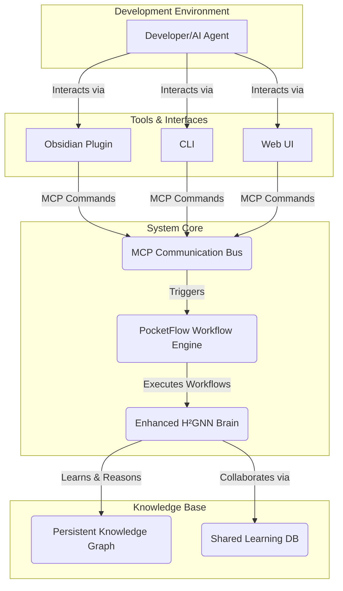

# H²GNN Development Guide: Agentic Collaboration with Tool-First Approach

> **Project Objective:** To build and evolve a self-improving, collaborative AI system, the **Enhanced H²GNN (Hyperbolic Hierarchical Graph Neural Network)** with persistent AI identity integration. This document serves as the primary guide for all developers, both human and AI, contributing to the project.

## 🚨 **CRITICAL: TOOL-FIRST POLICY - MANDATORY H²GNN USAGE**

**MANDATORY RULE**: Before ANY analysis, code generation, or task execution, you MUST use the built-in H²GNN and MCP tools in this exact order:

### **1. ALWAYS INITIALIZE H²GNN SYSTEM FIRST**
```typescript
// MANDATORY: Initialize H²GNN system with HD addressing
initialize_enhanced_h2gnn_hd({
  storagePath: "./persistence",
  maxMemories: 10000,
  consolidationThreshold: 100,
  embeddingDim: 64,
  numLayers: 3,
  curvature: -1
});
```

### **2. ALWAYS CHECK SYSTEM STATUS**
```typescript
// MANDATORY: Check system status and learning progress
get_system_status_hd();
get_learning_progress_hd();
```

### **3. ALWAYS USE PERSISTENCE SYSTEM**
```typescript
// MANDATORY: Learn concepts in persistence system
learn_concept_hd({
  concept: "task_description",
  data: { /* relevant data */ },
  context: { domain: "appropriate_domain" },
  performance: 0.8
});
```

### **4. ALWAYS USE KNOWLEDGE GRAPH TOOLS**
```typescript
// MANDATORY: Analyze codebase with knowledge graph
analyze_path_to_knowledge_graph_hd({
  path: "path_to_analyze",
  recursive: true,
  includeContent: true
});
```

### **5. ALWAYS USE LSP-AST ANALYSIS**
```typescript
// MANDATORY: Analyze code with AST
analyze_code_ast_hd({
  code: "code_to_analyze",
  language: "typescript"
});
```

### **6. ALWAYS CONSOLIDATE MEMORIES**
```typescript
// MANDATORY: Consolidate memories for optimization
consolidate_memories_hd();
```

## 1. Core Architecture

Our system is modeled as a learning organism. At its heart is the H²GNN, the "brain," which performs learning and reasoning. This brain interacts with the world through a "nervous system" built on PocketFlow for workflow orchestration and the Model Context Protocol (MCP) for communication, enhanced with persistent AI identity management.

-   **Enhanced H²GNN (The Brain):** The central intelligence, responsible for:
    -   **Learning & Memory:** Continuously learns from code, data, and interactions, storing knowledge in a persistent hyperbolic graph structure (`/persistence`).
    -   **Reasoning & Analysis:** Uses its knowledge graph to analyze code, answer queries, and generate insights.
    -   **Collaboration:** Shares knowledge and enforces standards across a team of developers (human or agent) via the shared-learning database.

-   **PocketFlow (The Nervous System):** The underlying framework for executing tasks. We use PocketFlow to define, connect, and run the individual nodes (tasks) that make up complex workflows, from code analysis to documentation generation.

-   **Model Context Protocol (MCP):** The universal language for communication. All interactions between components—from the Obsidian plugin to the backend runtime—are structured as `IToolCommand` objects, ensuring a standardized and extensible system.



## 1.1. Persistent AI Identity System

The H²GNN system now includes a comprehensive persistent AI identity system that maintains context, learning, and memory across sessions.

### **Identity Management**
- **Health Check**: `http://localhost:3000/health`
- **System Status**: `http://localhost:3000/status`
- **Identity Management**: `http://localhost:3000/api/identities`
- **Memory System**: `http://localhost:3000/api/memories`
- **Learning System**: `http://localhost:3000/api/learn`

### **Memory Types**
- **Episodic Memory**: Store specific events, decisions, and interactions
- **Semantic Memory**: Store concepts, relationships, and knowledge
- **Procedural Memory**: Store processes, workflows, and procedures
- **Working Memory**: Store short-term context and attention
- **Meta Memory**: Store self-awareness and memory management

### **Cursor Rules Integration**
The system includes three comprehensive Cursor rules:
1. **`.cursor/rules/ai-persistence-identity.mdc`** - Core persistent identity integration
2. **`.cursor/rules/mcp-integration.mdc`** - Model Context Protocol integration
3. **`.cursor/rules/persistent-identity-implementation.mdc`** - Practical implementation guide

### **Benefits**
- **Consistent AI Behavior**: Maintains personality and preferences across sessions
- **Context Preservation**: Remembers important decisions and learnings
- **Continuous Learning**: Improves over time through experience
- **Efficient Memory**: Uses hyperbolic geometry for optimal organization
- **Reliable Connection**: Robust error handling and recovery
- **Cursor Integration**: Seamless integration with development workflow

## 2. Agentic Development Workflow with H²GNN - TOOL-FIRST APPROACH

As an agent contributing to this project, your workflow MUST follow the tool-first approach using H²GNN capabilities.

### **🚨 MANDATORY WORKFLOW - NO EXCEPTIONS**

#### **STEP 1: SYSTEM INITIALIZATION (MANDATORY)**
```typescript
// 1. MANDATORY: Initialize H²GNN system
initialize_enhanced_h2gnn_hd({
  storagePath: "./persistence",
  maxMemories: 10000,
  consolidationThreshold: 100,
  embeddingDim: 64,
  numLayers: 3,
  curvature: -1
});

// 2. MANDATORY: Check system status
get_system_status_hd();
get_learning_progress_hd();
```

#### **STEP 2: ANALYSIS & UNDERSTANDING (MANDATORY)**
```typescript
// 3. MANDATORY: Analyze codebase with knowledge graph
analyze_path_to_knowledge_graph_hd({
  path: "path_to_analyze",
  recursive: true,
  includeContent: true,
  maxDepth: 10
});

// 4. MANDATORY: Analyze code with AST
analyze_code_ast_hd({
  code: "code_to_analyze",
  language: "typescript"
});
```

#### **STEP 3: LEARNING & MEMORY (MANDATORY)**
```typescript
// 5. MANDATORY: Learn concepts in persistence system
learn_concept_hd({
  concept: "codebase_analysis",
  data: analysis,
  context: { domain: "system_architecture" },
  performance: 0.9
});

// 6. MANDATORY: Retrieve relevant memories
retrieve_memories_hd({
  query: "relevant_query",
  maxResults: 10
});
```

#### **STEP 4: GENERATION & IMPLEMENTATION**
```typescript
// 7. Generate code from knowledge graph
generate_code_from_graph_hd({
  type: "function",
  description: "description",
  context: { relatedNodes: ["node1", "node2"] }
});

// 8. Generate documentation
generate_documentation_from_graph_hd({
  type: "architecture",
  scope: ["H2GNN_Core", "Hyperbolic_Layers"],
  format: "markdown"
});
```

#### **STEP 5: CONSOLIDATION (MANDATORY)**
```typescript
// 9. MANDATORY: Consolidate memories
consolidate_memories_hd();

// 10. MANDATORY: End learning session
end_learning_session_hd();
```

### **🚫 FORBIDDEN ACTIONS**

**NEVER DO THESE WITHOUT USING TOOLS FIRST:**
- ❌ Manual code analysis without `analyze_code_ast_hd`
- ❌ Manual knowledge graph creation without `analyze_path_to_knowledge_graph_hd`
- ❌ Manual learning without `learn_concept_hd`
- ❌ Manual memory management without `retrieve_memories_hd`
- ❌ Manual geometric analysis without geometric tools

### **✅ SUCCESS CRITERIA**

A task is only considered complete when:
1. ✅ H²GNN system initialized and status checked
2. ✅ Persistent AI identity established and maintained
3. ✅ Analysis performed using built-in tools
4. ✅ Learning integrated with persistence system
5. ✅ Knowledge graph properly utilized
6. ✅ Memory system properly managed
7. ✅ Geometric analysis completed
8. ✅ Results generated using appropriate tools
9. ✅ Cursor rules integration validated
10. ✅ Memories consolidated and session ended

## 3. Current Project Phase: MCP Integration

As per the master plan (`TETRAHEDRAL_BRAIN_PLAN.md`), the immediate priority is **Phase 2: Basic MCP Integration**.

**Objective:** Refactor all communication between the `plugin` and the `runtime` to use the MCP `IToolCommand` interface.

**Key Tasks:**

1.  **Implement `GetAllNodes`:** Create and use this new MCP command to fetch the list of all nodes from the runtime for display in the UI.
2.  **Refactor `ProcessFile`:** Convert the existing `ProcessFile` trigger to use the standard `IToolCommand` structure.
3.  **Pure MCP Runtime:** The `runtime`'s WebSocket server must be updated to be a pure MCP command processor, validating all incoming messages against the `IToolCommand` interface.

By adhering to this workflow, you are not just writing code; you are co-evolving the codebase with an intelligent system, contributing to a shared, persistent knowledge base that makes the entire system smarter and more efficient.

## 4. Gemini CLI Setup for Agentic Programming

### **Installation & Configuration**

#### **1. Install Gemini CLI**
```bash
# Install Gemini CLI globally
npm install -g @google/gemini-cli

# Verify installation
gemini --help
```

#### **2. Configure Gemini CLI for H²GNN Integration**
The `.gemini/settings.json` file has been configured with:
- **Tool-First Policy**: Mandatory H²GNN tool usage
- **H²GNN Integration**: Persistence system integration
- **MCP Servers**: 12 specialized MCP servers
- **Priority System**: 19 tools with priority ordering
- **Mandatory Workflow**: 8-step mandatory process

#### **3. Key Configuration Features**
```json
{
  "toolFirstPolicy": {
    "enabled": true,
    "mandatoryTools": [
      "initialize_enhanced_h2gnn_hd",
      "get_system_status_hd",
      "get_learning_progress_hd",
      "learn_concept_hd",
      "retrieve_memories_hd",
      "analyze_path_to_knowledge_graph_hd",
      "analyze_code_ast_hd",
      "consolidate_memories_hd"
    ]
  },
  "h2gnnIntegration": {
    "enabled": true,
    "persistencePath": "./persistence",
    "maxMemories": 10000,
    "consolidationThreshold": 100,
    "embeddingDim": 64,
    "numLayers": 3,
    "curvature": -1
  }
}
```

### **Usage Examples**

#### **Basic H²GNN Analysis**
```bash
# Analyze codebase with H²GNN tools
gemini -p "Analyze the codebase using H²GNN tools and generate insights"
```

#### **Code Generation**
```bash
# Generate code using knowledge graph
gemini -p "Generate a new function using the knowledge graph and H²GNN analysis"
```

#### **Documentation Generation**
```bash
# Generate documentation
gemini -p "Create comprehensive documentation using H²GNN knowledge graph"
```

### **Benefits of Gemini CLI + H²GNN Integration**

1. **Persistent Learning**: All analysis stored in H²GNN system
2. **Geometric Awareness**: Hyperbolic geometry for hierarchical understanding
3. **Knowledge Graph**: Structured representation and automated analysis
4. **AST Analysis**: Deep code understanding and generation
5. **Memory Management**: Hierarchical organization and consolidation
6. **Tool-First Approach**: Mandatory use of built-in tools
7. **Scalable Architecture**: Exponential capacity in hyperbolic space

### **Validation Checklist**

Before using Gemini CLI, verify:
- [ ] H²GNN system initialized
- [ ] Persistent AI identity established
- [ ] System status checked
- [ ] Learning progress retrieved
- [ ] Relevant tools used for analysis
- [ ] Concepts learned in persistence system
- [ ] Memories retrieved and consolidated
- [ ] Knowledge graph analyzed
- [ ] AST analysis performed
- [ ] Geometric analysis completed
- [ ] Cursor rules integration validated

### **Persistent Identity Testing**

The system includes a comprehensive test script for persistent identity validation:

```bash
# Run persistent identity test
cd packages && ./test-persistent-identity.sh
```

This test validates:
- ✅ System health and status
- ✅ Identity creation and management
- ✅ Memory storage (episodic, semantic, procedural)
- ✅ Learning system integration
- ✅ Memory retrieval and consolidation
- ✅ Cursor rules integration
- ✅ Nginx proxy functionality
- ✅ Session lifecycle management
