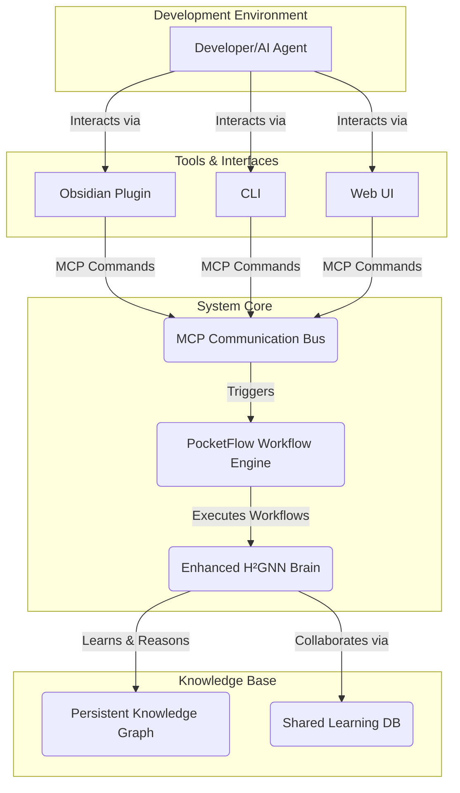

# H²GNN Development Guide: Agentic Collaboration

> **Project Objective:** To build and evolve a self-improving, collaborative AI system, the **Enhanced H²GNN (Hyperbolic Hierarchical Graph Neural Network)**. This document serves as the primary guide for all developers, both human and AI, contributing to the project.

## 1. Core Architecture

Our system is modeled as a learning organism. At its heart is the H²GNN, the "brain," which performs learning and reasoning. This brain interacts with the world through a "nervous system" built on PocketFlow for workflow orchestration and the Model Context Protocol (MCP) for communication.

-   **Enhanced H²GNN (The Brain):** The central intelligence, responsible for:
    -   **Learning & Memory:** Continuously learns from code, data, and interactions, storing knowledge in a persistent hyperbolic graph structure (`/persistence`).
    -   **Reasoning & Analysis:** Uses its knowledge graph to analyze code, answer queries, and generate insights.
    -   **Collaboration:** Shares knowledge and enforces standards across a team of developers (human or agent) via the shared-learning database.

-   **PocketFlow (The Nervous System):** The underlying framework for executing tasks. We use PocketFlow to define, connect, and run the individual nodes (tasks) that make up complex workflows, from code analysis to documentation generation.

-   **Model Context Protocol (MCP):** The universal language for communication. All interactions between components—from the Obsidian plugin to the backend runtime—are structured as `IToolCommand` objects, ensuring a standardized and extensible system.

## 2. Agentic Development Workflow with H²GNN

As an agent contributing to this project, your workflow must leverage the H²GNN's capabilities.

1.  **Analyze & Understand (Don't just read, *ask*):** Before making changes, ensure the H²GNN understands the current state of the code.
    -   **Command:** `analyze_path_to_knowledge_graph(path=<path>)`
    -   **Purpose:** To update the H²GNN's internal knowledge graph of the specified codebase. **This should be your first step.**

2.  **Query & Retrieve:** Use the H²GNN's memory to gather context.
    -   **Command:** `retrieve_memories(query=<query>)` or `get_understanding_snapshot(domain=<domain>)`
    -   **Purpose:** To get insights, find relevant code, or understand existing patterns before you start coding.

3.  **Implement & Teach:** As you implement features or fix bugs, teach the H²GNN about the changes. This is critical for keeping the system's knowledge up-to-date.
    -   **Command:** `learn_concept(concept=<description>, data={...}, context={...})`
    -   **Purpose:** To create a new memory in the H²GNN. For example, after implementing a new function, teach the H²GNN about its purpose, inputs, and outputs.

4.  **Generate & Refactor:** Leverage the H²GNN's understanding to generate new code or documentation.
    -   **Command:** `generate_code_from_graph(...)`
    -   **Purpose:** To create new functions, classes, or even documentation based on the system's holistic understanding of the codebase.

5.  **Verify & Consolidate:** After implementing changes, run tests and analysis. End your session to allow the H²GNN to consolidate what it has learned.
    -   **Command:** `end_learning_session()`
    -   **Purpose:** Triggers the memory consolidation process, integrating new knowledge into the main graph.

## 3. Current Project Phase: MCP Integration

As per the master plan (`TETRAHEDRAL_BRAIN_PLAN.md`), the immediate priority is **Phase 2: Basic MCP Integration**.

**Objective:** Refactor all communication between the `plugin` and the `runtime` to use the MCP `IToolCommand` interface.

**Key Tasks:**

1.  **Implement `GetAllNodes`:** Create and use this new MCP command to fetch the list of all nodes from the runtime for display in the UI.
2.  **Refactor `ProcessFile`:** Convert the existing `ProcessFile` trigger to use the standard `IToolCommand` structure.
3.  **Pure MCP Runtime:** The `runtime`'s WebSocket server must be updated to be a pure MCP command processor, validating all incoming messages against the `IToolCommand` interface.

By adhering to this workflow, you are not just writing code; you are co-evolving the codebase with an intelligent system, contributing to a shared, persistent knowledge base that makes the entire system smarter and more efficient.
