# Model Context Protocol (MCP) Integration Guide

## 🌟 Overview

This guide documents the complete integration of the **Model Context Protocol (MCP) TypeScript SDK** with our **H²GNN + PocketFlow + WordNet** system, enabling seamless **AI-human collaboration** through standardized interfaces.

## 🎯 What is MCP?

The Model Context Protocol (MCP) is an open standard that enables AI assistants to securely connect to external data sources and tools. Our implementation creates a bridge between AI agents and the H²GNN system, allowing for:

- **Standardized Tool Access**: AI agents can use H²GNN capabilities through well-defined interfaces
- **Resource Management**: Access to WordNet data, embeddings, and system state
- **Collaborative Workflows**: Multi-participant sessions with humans and AI agents
- **Real-time Interaction**: Live collaboration on complex reasoning tasks

## 🏗️ Architecture

```mermaid
graph TB
    subgraph "AI Agents"
        A1[Claude/GPT-4]
        A2[Local AI Assistant]
        A3[Custom Agent]
    end
    
    subgraph "MCP Layer"
        MCP[MCP Server]
        CI[Collaboration Interface]
        TOOLS[Tool Handlers]
        RES[Resource Handlers]
        PROMPTS[Prompt Handlers]
    end
    
    subgraph "H²GNN System"
        WN[WordNet Processor]
        H2G[H²GNN Core]
        PF[PocketFlow Workflows]
        HA[Hyperbolic Arithmetic]
    end
    
    subgraph "Human Participants"
        H1[Domain Expert]
        H2[Data Analyst]
        H3[Researcher]
    end
    
    A1 --> MCP
    A2 --> MCP
    A3 --> MCP
    
    MCP --> TOOLS
    MCP --> RES
    MCP --> PROMPTS
    
    TOOLS --> WN
    TOOLS --> H2G
    TOOLS --> PF
    
    CI --> H1
    CI --> H2
    CI --> H3
    
    WN --> HA
    H2G --> HA
    PF --> HA
```



## 🛠️ Core Components

### 1. MCP Server (`h2gnn-mcp-server.ts`)

The main MCP server that exposes H²GNN capabilities:

#### **Tools Available:**
- `initialize_wordnet`: Set up WordNet with hyperbolic embeddings
- `query_wordnet`: Search and analyze WordNet concepts
- `compute_hyperbolic_distance`: Calculate semantic distances
- `run_hierarchical_qa`: Execute Q&A workflows
- `explore_semantic_space`: Navigate concept relationships
- `train_concept_embeddings`: Learn new concept representations
- `analyze_hierarchy`: Examine taxonomic structures

#### **Resources Exposed:**
- `h2gnn://wordnet/synsets`: WordNet synset data
- `h2gnn://wordnet/hierarchy`: Hierarchical concept structure
- `h2gnn://embeddings/all`: Hyperbolic embedding data
- `h2gnn://workflows/active`: Running workflow status
- `h2gnn://system/status`: System health and metrics

#### **Prompts Provided:**
- `concept_analysis`: Guide AI through concept analysis
- `hierarchical_reasoning`: Structure reasoning about relationships
- `semantic_exploration`: Direct exploration workflows

### 2. Collaboration Interface (`collaboration-interface.ts`)

High-level interface for managing AI-human collaboration sessions:

#### **Key Features:**
- **Session Management**: Create and manage collaborative sessions
- **Multi-participant Support**: Handle both AI and human participants
- **Real-time Collaboration**: Live interaction and knowledge sharing
- **Context Preservation**: Maintain session history and insights
- **AI Assistance**: Provide intelligent suggestions to human participants

#### **Core Methods:**
```typescript
// Create collaboration session
createSession(config: SessionConfig): Promise<string>

// Analyze concepts collaboratively
analyzeConceptCollaboratively(sessionId: string, concept: string, participant: string): Promise<ConceptInsight>

// Perform collaborative reasoning
performCollaborativeReasoning(sessionId: string, question: string, participant: string): Promise<ReasoningChain>

// Get AI assistance for humans
getAIAssistance(sessionId: string, request: string, human: string): Promise<AssistanceResponse>

// Train concepts together
trainConceptsCollaboratively(sessionId: string, concepts: string[], relationships: Relationship[]): Promise<TrainingResult>
```

## 🚀 Getting Started

### Installation

```bash
# Install MCP SDK and dependencies
npm install @modelcontextprotocol/sdk zod

# Verify installation
npm run type-check
```

### Running the MCP Server

```bash
# Start the MCP server
npm run mcp:server

# Run collaboration demo
npm run mcp:demo

# Run all demos
npm run demo:all
```

### Basic Usage Example

```typescript
import { AIHumanCollaborationInterface } from './src/mcp/collaboration-interface.js';

// Initialize collaboration
const collaboration = new AIHumanCollaborationInterface();
await collaboration.initialize();

// Create session
const sessionId = await collaboration.createSession({
  domain: 'Biology Research',
  participants: [
    { type: 'human', name: 'Dr. Smith', capabilities: ['domain_expertise'] },
    { type: 'ai', name: 'H²GNN Assistant', capabilities: ['hyperbolic_reasoning'] }
  ],
  goals: ['Explore animal taxonomy', 'Develop new classifications']
});

// Analyze concept collaboratively
const insight = await collaboration.analyzeConceptCollaboratively(
  sessionId, 
  'mammal', 
  'Dr. Smith'
);

console.log(`Definition: ${insight.definition}`);
console.log(`Parents: ${insight.hierarchicalPosition.parents.join(', ')}`);
```

## 🤝 Collaboration Workflows

### 1. Expert-AI Concept Analysis

**Scenario**: Domain expert works with AI to analyze biological concepts

```typescript
// Human expert initiates analysis
const conceptInsight = await collaboration.analyzeConceptCollaboratively(
  sessionId, 'carnivore', 'Dr. Expert'
);

// AI provides computational analysis
const reasoning = await collaboration.performCollaborativeReasoning(
  sessionId,
  'How do carnivores relate to their prey in the food chain?',
  'AI Assistant'
);

// Human expert validates and extends
const assistance = await collaboration.getAIAssistance(
  sessionId,
  'What are the implications for ecosystem modeling?',
  'Dr. Expert'
);
```

### 2. Multi-Participant Research Session

**Scenario**: Research team collaborates on new taxonomy

```typescript
const sessionId = await collaboration.createSession({
  domain: 'Taxonomic Research',
  participants: [
    { type: 'human', name: 'Lead Researcher', capabilities: ['research_design'] },
    { type: 'human', name: 'Data Analyst', capabilities: ['statistical_analysis'] },
    { type: 'ai', name: 'H²GNN System', capabilities: ['hyperbolic_modeling'] }
  ],
  goals: ['Develop hybrid classification system']
});

// Collaborative concept training
const trainingResult = await collaboration.trainConceptsCollaboratively(
  sessionId,
  ['hybrid_species', 'adaptive_behavior'],
  [
    { source: 'species_a', target: 'hybrid_species', type: 'genetic_contribution' },
    { source: 'species_b', target: 'hybrid_species', type: 'genetic_contribution' }
  ],
  'Lead Researcher'
);
```

### 3. Real-time Discovery Workflow

**Scenario**: Live collaboration during research discovery

```typescript
// New observation triggers collaboration
const discovery = await collaboration.performCollaborativeReasoning(
  sessionId,
  'We observed unusual behavior in domesticated wolves. How should we classify this?',
  'Field Researcher'
);

// AI suggests new concepts
const suggestions = await collaboration.getAIAssistance(
  sessionId,
  'domesticated wolf with dog-like behavior',
  'Field Researcher'
);

// Team develops new classification
const newClassification = await collaboration.trainConceptsCollaboratively(
  sessionId,
  ['behavioral_hybrid', 'domestication_gradient'],
  [/* relationships */],
  'Research Team'
);
```

## 📊 Session Analytics

The system provides comprehensive analytics for collaboration sessions:

```typescript
const insights = await collaboration.getSessionInsights(sessionId);

console.log('Session Summary:', insights.summary);
console.log('Key Findings:', insights.keyFindings);
console.log('Concepts Explored:', insights.conceptsExplored);
console.log('Collaboration Metrics:', insights.collaborationMetrics);
```

**Metrics Include:**
- Total collaborative actions
- Participant contribution distribution
- Concepts covered and relationships discovered
- Reasoning chains completed
- Knowledge artifacts created

## 🔧 Configuration

### MCP Server Configuration (`mcp.json`)

```json
{
  "mcpServers": {
    "h2gnn": {
      "command": "node",
      "args": ["src/mcp/h2gnn-mcp-server.js"],
      "env": {
        "NODE_ENV": "production"
      }
    }
  }
}
```

### Environment Variables

```bash
# Optional configuration
NODE_ENV=production
MCP_LOG_LEVEL=info
H2GNN_EMBEDDING_DIM=128
WORDNET_MAX_SYNSETS=10000
```

## 🧪 Testing and Validation

### Running Tests

```bash
# Test WordNet functionality
npm run wordnet:demo

# Test MCP collaboration
npm run mcp:demo

# Run all demonstrations
npm run demo:all
```

### Validation Checklist

- [ ] MCP server starts without errors
- [ ] WordNet initializes with embeddings
- [ ] All tools respond correctly
- [ ] Resources are accessible
- [ ] Prompts generate appropriate guidance
- [ ] Collaboration sessions work end-to-end
- [ ] Multi-participant workflows function
- [ ] Session analytics are accurate

## 🎯 Use Cases

### 1. **Scientific Research**
- Collaborative taxonomy development
- Hypothesis generation and testing
- Literature analysis and synthesis
- Cross-domain knowledge integration

### 2. **Educational Applications**
- Interactive concept learning
- Guided exploration of knowledge domains
- Collaborative problem-solving
- Adaptive tutoring systems

### 3. **Knowledge Management**
- Organizational knowledge synthesis
- Expert system development
- Decision support systems
- Collaborative intelligence platforms

### 4. **AI Development**
- Human-in-the-loop training
- Concept validation and refinement
- Bias detection and correction
- Explainable AI development

## 🔮 Advanced Features

### Custom Tool Development

```typescript
// Add custom tools to the MCP server
this.server.setRequestHandler(CallToolRequestSchema, async (request) => {
  const { name, arguments: args } = request.params;
  
  switch (name) {
    case "custom_analysis":
      return await this.customAnalysis(args);
    // ... other tools
  }
});
```

### Resource Streaming

```typescript
// Stream large datasets
this.server.setRequestHandler(ReadResourceRequestSchema, async (request) => {
  const { uri } = request.params;
  
  if (uri === "h2gnn://stream/embeddings") {
    return this.streamEmbeddings();
  }
});
```

### Dynamic Prompt Generation

```typescript
// Generate context-aware prompts
private generateDynamicPrompt(context: SessionContext): PromptMessage {
  return {
    role: "user",
    content: {
      type: "text",
      text: `Given the current session context: ${JSON.stringify(context)}, 
             please analyze the following concept...`
    }
  };
}
```

## 🚨 Troubleshooting

### Common Issues

1. **Server Won't Start**
   ```bash
   # Check dependencies
   npm install
   
   # Verify TypeScript compilation
   npm run type-check
   
   # Check for port conflicts
   lsof -i :3000
   ```

2. **WordNet Initialization Fails**
   ```bash
   # Verify data files exist
   ls -la src/datasets/
   
   # Check memory usage
   node --max-old-space-size=4096 src/mcp/h2gnn-mcp-server.js
   ```

3. **Collaboration Sessions Timeout**
   ```typescript
   // Increase timeout in client
   const client = new Client({
     name: "client",
     version: "1.0.0"
   }, {
     capabilities: {},
     timeout: 30000 // 30 seconds
   });
   ```

### Debug Mode

```bash
# Enable debug logging
DEBUG=mcp:* npm run mcp:server

# Verbose collaboration demo
DEBUG=collaboration:* npm run mcp:demo
```

## 📈 Performance Optimization

### Memory Management
- Use streaming for large datasets
- Implement pagination for results
- Clear session history periodically
- Monitor embedding cache size

### Concurrency
- Handle multiple sessions simultaneously
- Use worker threads for heavy computations
- Implement request queuing
- Add rate limiting for stability

### Caching
- Cache frequently accessed WordNet data
- Store computed distances
- Persist session state
- Use Redis for distributed caching

## 🔒 Security Considerations

- Validate all input parameters
- Sanitize user-provided concepts
- Implement session isolation
- Add authentication for production use
- Monitor resource usage
- Log all collaborative actions

## 🌟 Future Enhancements

### Planned Features
- [ ] Multi-modal collaboration (text, images, audio)
- [ ] Distributed collaboration across networks
- [ ] Advanced visualization interfaces
- [ ] Integration with external knowledge bases
- [ ] Real-time collaborative editing
- [ ] Version control for concept evolution

### Integration Opportunities
- Jupyter notebook integration
- VS Code extension
- Web-based collaboration platform
- Mobile collaboration apps
- VR/AR research environments

## 📚 References

- [Model Context Protocol Specification](https://modelcontextprotocol.io/)
- [MCP TypeScript SDK Documentation](https://github.com/modelcontextprotocol/typescript-sdk)
- [H²GNN Research Papers](./RESEARCH_REFERENCES.md)
- [PocketFlow Documentation](https://the-pocket.github.io/PocketFlow/)
- [WordNet Database](https://wordnet.princeton.edu/)

## 🤝 Contributing

We welcome contributions to enhance the MCP integration:

1. Fork the repository
2. Create a feature branch
3. Implement your enhancement
4. Add comprehensive tests
5. Update documentation
6. Submit a pull request

## 📄 License

This MCP integration is part of the H²GNN project and follows the same licensing terms.

---

**🎉 Congratulations!** You now have a complete AI-human collaboration system powered by hyperbolic geometry, semantic reasoning, and standardized protocols. The future of collaborative intelligence is here!
