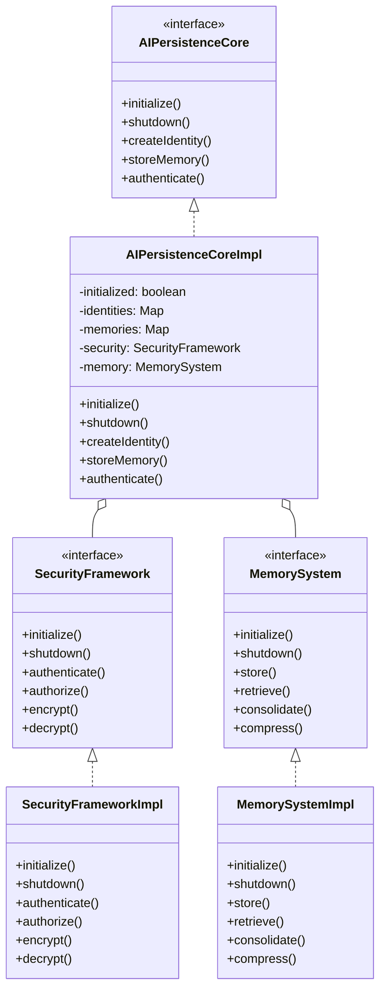

```mermaid
classDiagram
    class AIPersistenceCore {
        <<interface>>
        +initialize()
        +shutdown()
        +createIdentity()
        +storeMemory()
        +authenticate()
    }

    class AIPersistenceCoreImpl {
        -initialized: boolean
        -identities: Map
        -memories: Map
        -security: SecurityFramework
        -memory: MemorySystem
        +initialize()
        +shutdown()
        +createIdentity()
        +storeMemory()
        +authenticate()
    }

    class SecurityFramework {
        <<interface>>
        +initialize()
        +shutdown()
        +authenticate()
        +authorize()
        +encrypt()
        +decrypt()
    }

    class SecurityFrameworkImpl {
        +initialize()
        +shutdown()
        +authenticate()
        +authorize()
        +encrypt()
        +decrypt()
    }

    class MemorySystem {
        <<interface>>
        +initialize()
        +shutdown()
        +store()
        +retrieve()
        +consolidate()
        +compress()
    }

    class MemorySystemImpl {
        +initialize()
        +shutdown()
        +store()
        +retrieve()
        +consolidate()
        +compress()
    }

    AIPersistenceCore <|.. AIPersistenceCoreImpl
    AIPersistenceCoreImpl o-- SecurityFramework
    AIPersistenceCoreImpl o-- MemorySystem
    SecurityFramework <|.. SecurityFrameworkImpl
    MemorySystem <|.. MemorySystemImpl
```
