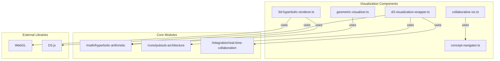

# Visualization Architecture

This document provides an overview of the visualization architecture of the H²GNN project. It includes a diagram that shows the relationships between the different visualization components and their dependencies.

## Visualization Components Diagram

The following diagram illustrates the architecture of the visualization components:

### Diagram Explanation

This diagram shows the main components of the visualization system and their dependencies:

*   **`3d-hyperbolic-renderer.ts`**: A WebGL-based renderer for 3D hyperbolic embeddings. It relies on the `hyperbolic-arithmetic` module for mathematical calculations.

*   **`collaborative-viz.ts`**: Enables multi-user collaborative visualization sessions. It uses the `concept-navigator` to manage the concepts being visualized.

*   **`concept-navigator.ts`**: Provides interactive concept navigation and exploration features.

*   **`d3-visualization-wrapper.ts`**: An enhanced D3-based visualizer for hyperbolic-geographic data. It uses the `pubsub-architecture` for real-time updates and the `real-time-collaboration` module for collaborative features.

*   **`geometric-visualizer.ts`**: A 2D visualizer for hyperbolic geometry. It also uses the `hyperbolic-arithmetic` module for its calculations.

*   **External Libraries**: The visualization components also depend on external libraries like **WebGL** for 3D rendering and **D3.js** for 2D data visualization.
