# Demo Functionality Analysis

This document provides an analysis of the demo files in the `src/demo` directory. It includes a dependency diagram to visualize the relationship between the demo files and the main application modules, as well as a summary of unimplemented or partially implemented functionality.

## Demo File Dependency Diagram

The following diagram shows the dependencies between the demo files and the main application modules.

```mermaid
graph TD
    subgraph "Demo Files"
        A["code-embedding-demo.ts"]
        B["devops-semantic-analysis-demo.ts"]
        C["enhanced-h2gnn-learning-demo.ts"]
        D["h2gnn-self-optimization-demo.ts"]
        E["integrated-demo.ts"]
        F["integrated-improvements-demo.ts"]
        G["knowledge-graph-demo.ts"]
        H["mcp-collaboration-demo.ts"]
        I["native-protocol-demo-core.ts"]
        J["native-protocol-demo-offline.ts"]
        K["native-protocol-demo.ts"]
        L["phase4-3d-visualization-demo.ts"]
        M["phase4-knowledge-transfer-demo.ts"]
        N["phase4-production-deployment-demo.ts"]
        O["phase4-production-llm-demo.ts"]
        P["simple-wordnet-test.ts"]
        Q["team-collaboration-demo.ts"]
        R["unified-system-demo.ts"]
        S["wordnet-training-demo.ts"]
    end

    subgraph "App Modules"
        analysis["/analysis"]
        core["/core"]
        math["/math"]
        datasets["/datasets"]
        training["/training"]
        workflows["/workflows"]
        mcp["/mcp.restored.old"]
        integration["/integration"]
        visualization["/visualization"]
        transfer["/transfer"]
        llm["/llm"]
        rules["/rules"]
    end

    A --> analysis
    A --> math
    B --> core
    C --> core
    D --> core
    D --> math
    D --> datasets
    E --> training
    E --> workflows
    E --> datasets
    E --> core
    E --> math
    F --> core
    F --> mcp
    G --> mcp
    H --> integration
    I --> core
    J --> core
    K --> core
    L --> visualization
    M --> transfer
    O --> llm
    O --> core
    Q --> core
    Q --> rules
    Q --> workflows
    R --> integration
    S --> datasets
    S --> training
    S --> workflows
```

## Unimplemented Functionality

Based on an analysis of the demo files, the following functionalities appear to be unimplemented or only partially implemented:

*   **`integrated-demo.ts`**: The `getMemoryUsage()` function is mocked and returns a random value. This indicates that the actual memory usage monitoring is not yet implemented.

*   **`integrated-improvements-demo.ts`**: The `authenticateUser` method in the `AuthService` class is not implemented and throws a `Not implemented` error. This is a critical part of the authentication system that needs to be implemented.

*   **`phase4-3d-visualization-demo.ts`**: The 3D renderer is mocked if WebGL is not available. This means that the 3D visualization will not work in environments without WebGL support. The export functionality for the visualization is also mocked.

*   **`phase4-knowledge-transfer-demo.ts`**: Most of the core functionality in this demo is mocked. This includes domain mapping, domain adaptation, knowledge distillation, and various transfer learning workflows. This suggests that the knowledge transfer features are still in the early stages of development.

*   **`phase4-production-llm-demo.ts`**: The LLM service is mocked and will not work without valid API keys. This is expected, but it's important to note that the LLM integration is not fully functional without proper configuration. The provider switching logic is also in a try-catch block, which might indicate that it's not fully robust yet.
