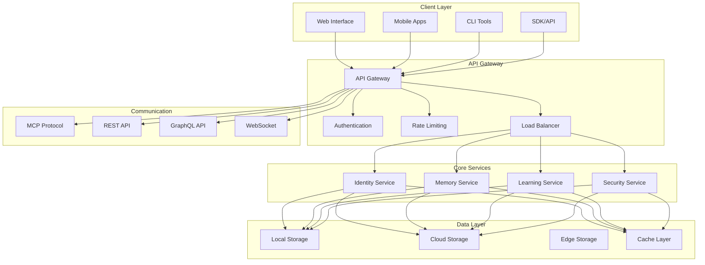
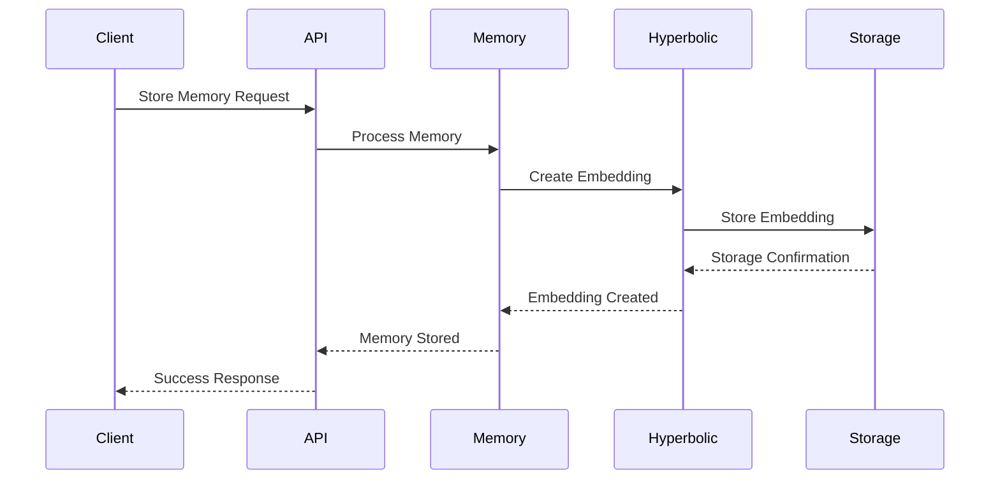
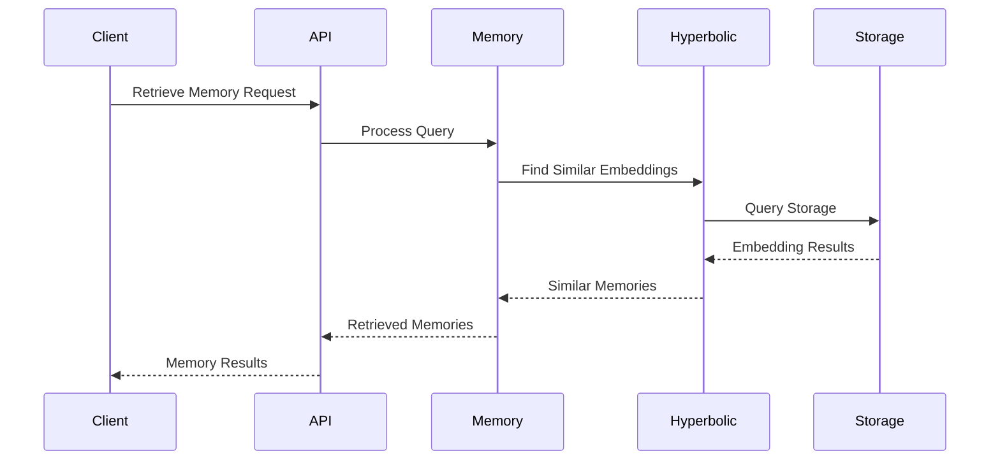
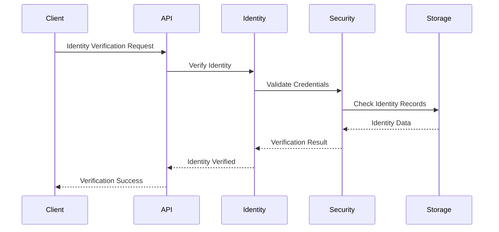

# AI Persistence Architecture Design

## Overview

This document outlines the detailed technical architecture for the AI Persistence and Identity system, building upon the existing H²GNN framework to create a comprehensive, scalable, and secure AI persistence package.

## Architecture Principles

### 1. Hyperbolic Geometric Foundation
- **Hyperbolic Embeddings**: All memories and identities stored in hyperbolic space
- **Geometric Consistency**: Maintain hyperbolic constraints across all operations
- **Distance Preservation**: Preserve semantic relationships through hyperbolic distances
- **Hierarchical Structure**: Leverage hyperbolic geometry for hierarchical memory organization

### 2. Distributed and Scalable
- **Microservices Architecture**: Modular, independently deployable services
- **Event-Driven Design**: Asynchronous communication and processing
- **Horizontal Scaling**: Auto-scaling based on demand
- **Edge Computing**: Distributed processing at the edge

### 3. Security and Privacy First
- **Zero-Trust Architecture**: No implicit trust, verify everything
- **End-to-End Encryption**: All data encrypted in transit and at rest
- **Privacy by Design**: Privacy considerations built into every component
- **Audit Trail**: Comprehensive logging and monitoring

### 4. Interoperability and Standards
- **Open Standards**: Use industry-standard protocols and formats
- **API-First Design**: Comprehensive APIs for all functionality
- **Plugin Architecture**: Extensible and customizable
- **Multi-Platform Support**: Cross-platform compatibility

## System Architecture

### High-Level Architecture



## Core Components

### 1. AI Identity System

#### Identity Core
```typescript
interface AIIdentity {
  // Core Identity
  id: string;                    // Unique identifier
  fingerprint: string;           // Cryptographic fingerprint
  version: string;              // Identity version
  
  // Capabilities
  capabilities: Capability[];    // AI capabilities
  limitations: Limitation[];    // Known limitations
  preferences: Preferences;      // User preferences
  
  // Relationships
  relationships: Relationship[]; // Relationships with other entities
  trustLevel: number;          // Trust level (0-1)
  
  // History
  creationTime: Date;          // Identity creation time
  lastUpdate: Date;           // Last update time
  history: IdentityEvent[];    // Identity history
  
  // Verification
  verification: Verification;   // Verification status
  certificates: Certificate[];  // Digital certificates
}

interface Capability {
  id: string;
  name: string;
  description: string;
  level: number;              // Capability level (0-1)
  confidence: number;         // Confidence in capability (0-1)
  lastValidated: Date;
  dependencies: string[];      // Required dependencies
}

interface Relationship {
  entityId: string;
  entityType: 'ai' | 'human' | 'system';
  relationshipType: 'collaboration' | 'mentorship' | 'partnership' | 'rivalry';
  strength: number;           // Relationship strength (0-1)
  trust: number;             // Trust level (0-1)
  history: RelationshipEvent[];
}
```

#### Identity Management
```typescript
class IdentityManager {
  // Identity Operations
  createIdentity(config: IdentityConfig): Promise<AIIdentity>;
  updateIdentity(id: string, updates: Partial<AIIdentity>): Promise<AIIdentity>;
  deleteIdentity(id: string): Promise<void>;
  getIdentity(id: string): Promise<AIIdentity>;
  
  // Verification
  verifyIdentity(id: string, proof: Proof): Promise<boolean>;
  revokeIdentity(id: string, reason: string): Promise<void>;
  
  // Relationships
  addRelationship(identityId: string, relationship: Relationship): Promise<void>;
  updateRelationship(identityId: string, entityId: string, updates: Partial<Relationship>): Promise<void>;
  removeRelationship(identityId: string, entityId: string): Promise<void>;
  
  // Capabilities
  addCapability(identityId: string, capability: Capability): Promise<void>;
  updateCapability(identityId: string, capabilityId: string, updates: Partial<Capability>): Promise<void>;
  removeCapability(identityId: string, capabilityId: string): Promise<void>;
  
  // Migration
  migrateIdentity(fromId: string, toId: string): Promise<void>;
  mergeIdentities(identities: string[]): Promise<AIIdentity>;
}
```

### 2. Distributed Memory System

#### Memory Architecture
```typescript
interface MemorySystem {
  // Memory Types
  episodic: EpisodicMemory;      // Event-based memories
  semantic: SemanticMemory;      // Knowledge-based memories
  procedural: ProceduralMemory;   // Skill-based memories
  working: WorkingMemory;        // Short-term working memory
  
  // Storage Layers
  local: LocalMemory;           // Local storage
  cloud: CloudMemory;          // Cloud storage
  edge: EdgeMemory;            // Edge storage
  
  // Operations
  store: MemoryStore;          // Memory storage operations
  retrieve: MemoryRetrieve;    // Memory retrieval operations
  consolidate: MemoryConsolidate; // Memory consolidation
  compress: MemoryCompress;    // Memory compression
}

interface EpisodicMemory {
  events: Event[];
  timeline: Timeline;
  associations: Association[];
  
  // Operations
  addEvent(event: Event): Promise<void>;
  getEvents(timeRange: TimeRange): Promise<Event[]>;
  findAssociations(event: Event): Promise<Association[]>;
  createTimeline(events: Event[]): Promise<Timeline>;
}

interface SemanticMemory {
  concepts: Concept[];
  relationships: Relationship[];
  hierarchies: Hierarchy[];
  
  // Operations
  addConcept(concept: Concept): Promise<void>;
  findConcepts(query: string): Promise<Concept[]>;
  getRelationships(concept: Concept): Promise<Relationship[]>;
  buildHierarchy(concepts: Concept[]): Promise<Hierarchy>;
}

interface ProceduralMemory {
  skills: Skill[];
  procedures: Procedure[];
  automations: Automation[];
  
  // Operations
  learnSkill(skill: Skill): Promise<void>;
  executeProcedure(procedure: Procedure): Promise<Result>;
  createAutomation(automation: Automation): Promise<void>;
}
```

#### Hyperbolic Memory Storage
```typescript
interface HyperbolicMemory {
  // Hyperbolic Embeddings
  embeddings: HyperbolicEmbedding[];
  relationships: HyperbolicRelationship[];
  hierarchies: HyperbolicHierarchy[];
  
  // Operations
  embed(memory: Memory): Promise<HyperbolicEmbedding>;
  findSimilar(embedding: HyperbolicEmbedding, threshold: number): Promise<Memory[]>;
  computeDistance(embedding1: HyperbolicEmbedding, embedding2: HyperbolicEmbedding): Promise<number>;
  consolidate(embeddings: HyperbolicEmbedding[]): Promise<ConsolidatedMemory>;
}

interface HyperbolicEmbedding {
  id: string;
  vector: number[];           // Hyperbolic coordinates
  norm: number;              // Hyperbolic norm
  curvature: number;         // Local curvature
  timestamp: Date;
  metadata: EmbeddingMetadata;
}

interface HyperbolicRelationship {
  source: string;            // Source embedding ID
  target: string;            // Target embedding ID
  distance: number;          // Hyperbolic distance
  relationshipType: string;  // Type of relationship
  strength: number;          // Relationship strength (0-1)
}
```

### 3. Security Framework

#### Security Architecture
```typescript
interface SecurityFramework {
  // Encryption
  encryption: EncryptionService;
  keyManagement: KeyManagementService;
  
  // Authentication
  authentication: AuthenticationService;
  authorization: AuthorizationService;
  
  // Privacy
  privacy: PrivacyService;
  anonymization: AnonymizationService;
  
  // Audit
  audit: AuditService;
  monitoring: MonitoringService;
}

interface EncryptionService {
  // Encryption Operations
  encrypt(data: any, key: string): Promise<EncryptedData>;
  decrypt(encryptedData: EncryptedData, key: string): Promise<any>;
  
  // Key Management
  generateKey(): Promise<string>;
  rotateKey(oldKey: string, newKey: string): Promise<void>;
  
  // Secure Communication
  establishSecureChannel(peer: string): Promise<SecureChannel>;
  sendSecureMessage(channel: SecureChannel, message: any): Promise<void>;
}

interface AuthenticationService {
  // Authentication Methods
  authenticate(credentials: Credentials): Promise<AuthResult>;
  refreshToken(token: string): Promise<AuthResult>;
  revokeToken(token: string): Promise<void>;
  
  // Multi-Factor Authentication
  enableMFA(identityId: string, method: MFAMethod): Promise<void>;
  verifyMFA(identityId: string, code: string): Promise<boolean>;
  
  // Biometric Authentication
  registerBiometric(identityId: string, biometric: Biometric): Promise<void>;
  authenticateBiometric(identityId: string, biometric: Biometric): Promise<boolean>;
}
```

### 4. Communication Protocol

#### Multi-Protocol Support
```typescript
interface CommunicationProtocol {
  // Protocol Support
  mcp: MCPProtocol;
  rest: RESTProtocol;
  graphql: GraphQLProtocol;
  websocket: WebSocketProtocol;
  grpc: gRPCProtocol;
  
  // Message Queue
  messageQueue: MessageQueue;
  eventBus: EventBus;
  
  // Service Discovery
  serviceDiscovery: ServiceDiscovery;
  loadBalancer: LoadBalancer;
}

interface MCPProtocol {
  // MCP Operations
  registerService(service: Service): Promise<void>;
  discoverServices(query: ServiceQuery): Promise<Service[]>;
  callTool(tool: string, args: any): Promise<any>;
  getResource(uri: string): Promise<Resource>;
  
  // Tool Management
  registerTool(tool: Tool): Promise<void>;
  unregisterTool(toolId: string): Promise<void>;
  listTools(): Promise<Tool[]>;
  
  // Resource Management
  registerResource(resource: Resource): Promise<void>;
  unregisterResource(uri: string): Promise<void>;
  listResources(): Promise<Resource[]>;
}

interface MessageQueue {
  // Queue Operations
  publish(topic: string, message: any): Promise<void>;
  subscribe(topic: string, handler: MessageHandler): Promise<void>;
  unsubscribe(topic: string, handler: MessageHandler): Promise<void>;
  
  // Message Processing
  processMessage(message: Message): Promise<void>;
  retryMessage(message: Message): Promise<void>;
  deadLetterMessage(message: Message): Promise<void>;
}
```

## Data Flow Architecture

### 1. Memory Storage Flow



### 2. Memory Retrieval Flow



### 3. Identity Verification Flow



## Storage Architecture

### 1. Multi-Tier Storage

```typescript
interface StorageArchitecture {
  // Storage Tiers
  hot: HotStorage;           // Frequently accessed data
  warm: WarmStorage;         // Occasionally accessed data
  cold: ColdStorage;         // Rarely accessed data
  archive: ArchiveStorage;   // Long-term archival data
  
  // Storage Types
  local: LocalStorage;       // Local file system
  cloud: CloudStorage;       // Cloud storage
  edge: EdgeStorage;         // Edge computing storage
  
  // Data Management
  replication: ReplicationService;
  backup: BackupService;
  migration: MigrationService;
}

interface HotStorage {
  // Fast Access Storage
  memory: MemoryCache;
  ssd: SSDStorage;
  
  // Operations
  get(key: string): Promise<any>;
  set(key: string, value: any): Promise<void>;
  delete(key: string): Promise<void>;
}

interface WarmStorage {
  // Medium Access Storage
  database: Database;
  cache: Cache;
  
  // Operations
  query(query: Query): Promise<Result[]>;
  insert(data: any): Promise<void>;
  update(id: string, data: any): Promise<void>;
  delete(id: string): Promise<void>;
}

interface ColdStorage {
  // Slow Access Storage
  objectStorage: ObjectStorage;
  fileSystem: FileSystem;
  
  // Operations
  store(key: string, data: any): Promise<void>;
  retrieve(key: string): Promise<any>;
  archive(key: string): Promise<void>;
}
```

### 2. Hyperbolic Storage Optimization

```typescript
interface HyperbolicStorage {
  // Hyperbolic Indexing
  index: HyperbolicIndex;
  clustering: HyperbolicClustering;
  compression: HyperbolicCompression;
  
  // Operations
  indexEmbedding(embedding: HyperbolicEmbedding): Promise<void>;
  findNeighbors(embedding: HyperbolicEmbedding, radius: number): Promise<HyperbolicEmbedding[]>;
  compressEmbeddings(embeddings: HyperbolicEmbedding[]): Promise<CompressedEmbedding>;
  decompressEmbedding(compressed: CompressedEmbedding): Promise<HyperbolicEmbedding>;
}

interface HyperbolicIndex {
  // Index Types
  tree: HyperbolicTree;
  hash: HyperbolicHash;
  graph: HyperbolicGraph;
  
  // Operations
  insert(embedding: HyperbolicEmbedding): Promise<void>;
  search(query: HyperbolicEmbedding, k: number): Promise<HyperbolicEmbedding[]>;
  delete(embedding: HyperbolicEmbedding): Promise<void>;
  update(embedding: HyperbolicEmbedding): Promise<void>;
}
```

## Performance Optimization

### 1. Caching Strategy

```typescript
interface CachingStrategy {
  // Cache Levels
  l1: L1Cache;              // CPU cache
  l2: L2Cache;              // Memory cache
  l3: L3Cache;              // Distributed cache
  
  // Cache Policies
  lru: LRUPolicy;           // Least Recently Used
  lfu: LFUPolicy;           // Least Frequently Used
  ttl: TTLPolicy;           // Time To Live
  
  // Operations
  get(key: string): Promise<any>;
  set(key: string, value: any, ttl?: number): Promise<void>;
  invalidate(key: string): Promise<void>;
  clear(): Promise<void>;
}
```

### 2. Parallel Processing

```typescript
interface ParallelProcessing {
  // Processing Types
  cpu: CPUProcessing;       // CPU-intensive tasks
  gpu: GPUProcessing;       // GPU-accelerated tasks
  distributed: DistributedProcessing; // Distributed processing
  
  // Task Management
  scheduler: TaskScheduler;
  executor: TaskExecutor;
  monitor: TaskMonitor;
  
  // Operations
  submitTask(task: Task): Promise<TaskResult>;
  cancelTask(taskId: string): Promise<void>;
  getTaskStatus(taskId: string): Promise<TaskStatus>;
}
```

### 3. Load Balancing

```typescript
interface LoadBalancing {
  // Load Balancer Types
  roundRobin: RoundRobinBalancer;
  leastConnections: LeastConnectionsBalancer;
  weighted: WeightedBalancer;
  geographic: GeographicBalancer;
  
  // Health Checking
  healthCheck: HealthCheck;
  failover: FailoverService;
  recovery: RecoveryService;
  
  // Operations
  route(request: Request): Promise<Response>;
  addServer(server: Server): Promise<void>;
  removeServer(serverId: string): Promise<void>;
  getServerStatus(serverId: string): Promise<ServerStatus>;
}
```

## Security Architecture

### 1. Zero-Trust Security

```typescript
interface ZeroTrustSecurity {
  // Zero-Trust Principles
  verify: VerifyService;     // Verify everything
  encrypt: EncryptService;   // Encrypt everything
  monitor: MonitorService;  // Monitor everything
  
  // Security Controls
  access: AccessControl;
  network: NetworkSecurity;
  data: DataSecurity;
  
  // Operations
  authenticate(identity: Identity): Promise<AuthResult>;
  authorize(identity: Identity, resource: Resource): Promise<AuthResult>;
  audit(action: Action): Promise<void>;
}
```

### 2. Privacy Preservation

```typescript
interface PrivacyPreservation {
  // Privacy Techniques
  anonymization: AnonymizationService;
  pseudonymization: PseudonymizationService;
  differentialPrivacy: DifferentialPrivacyService;
  homomorphicEncryption: HomomorphicEncryptionService;
  
  // Data Protection
  dataMinimization: DataMinimizationService;
  purposeLimitation: PurposeLimitationService;
  storageLimitation: StorageLimitationService;
  
  // Operations
  anonymize(data: any): Promise<AnonymizedData>;
  pseudonymize(data: any): Promise<PseudonymizedData>;
  applyDifferentialPrivacy(data: any, epsilon: number): Promise<PrivateData>;
}
```

## Monitoring and Observability

### 1. Comprehensive Monitoring

```typescript
interface MonitoringSystem {
  // Monitoring Types
  metrics: MetricsService;
  logging: LoggingService;
  tracing: TracingService;
  alerting: AlertingService;
  
  // Data Collection
  collectors: Collector[];
  processors: Processor[];
  exporters: Exporter[];
  
  // Operations
  collectMetric(metric: Metric): Promise<void>;
  logEvent(event: Event): Promise<void>;
  traceRequest(request: Request): Promise<Trace>;
  sendAlert(alert: Alert): Promise<void>;
}
```

### 2. Performance Monitoring

```typescript
interface PerformanceMonitoring {
  // Performance Metrics
  latency: LatencyMetrics;
  throughput: ThroughputMetrics;
  errorRate: ErrorRateMetrics;
  resourceUsage: ResourceUsageMetrics;
  
  // Monitoring Tools
  apm: APMService;
  profiling: ProfilingService;
  benchmarking: BenchmarkingService;
  
  // Operations
  measureLatency(operation: Operation): Promise<LatencyMeasurement>;
  measureThroughput(operation: Operation): Promise<ThroughputMeasurement>;
  profilePerformance(operation: Operation): Promise<ProfileResult>;
}
```

## Deployment Architecture

### 1. Container Orchestration

```typescript
interface ContainerOrchestration {
  // Orchestration Platforms
  kubernetes: KubernetesService;
  docker: DockerService;
  nomad: NomadService;
  
  // Service Management
  deployment: DeploymentService;
  scaling: ScalingService;
  health: HealthService;
  
  // Operations
  deploy(service: Service): Promise<DeploymentResult>;
  scale(service: Service, replicas: number): Promise<ScalingResult>;
  healthCheck(service: Service): Promise<HealthStatus>;
}
```

### 2. Cloud-Native Architecture

```typescript
interface CloudNativeArchitecture {
  // Cloud Platforms
  aws: AWSService;
  azure: AzureService;
  gcp: GCPService;
  
  // Cloud Services
  compute: ComputeService;
  storage: StorageService;
  network: NetworkService;
  security: SecurityService;
  
  // Operations
  provision(resource: Resource): Promise<ProvisionResult>;
  configure(config: Configuration): Promise<ConfigurationResult>;
  monitor(service: Service): Promise<MonitoringResult>;
}
```

## Conclusion

This architecture provides a comprehensive foundation for building a robust, scalable, and secure AI persistence and identity system. The modular design allows for incremental development and deployment while maintaining the flexibility to adapt to changing requirements and technologies.

The integration of hyperbolic geometry, distributed systems, and modern security practices creates a unique and powerful platform for AI persistence that can serve as the foundation for the next generation of AI systems.

---

*This architecture document serves as the technical blueprint for implementing the AI Persistence and Identity system. It should be used in conjunction with the research project document to guide the development process.*
