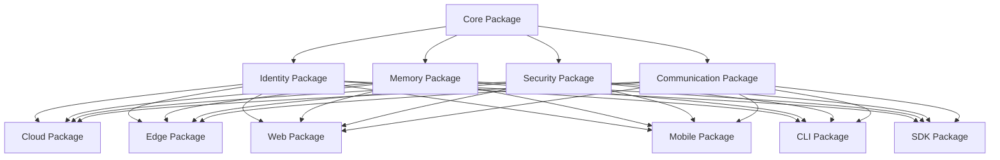

# AI Persistence Package Structure

## Overview

This document outlines the complete package structure for the AI Persistence and Identity system, providing a comprehensive framework for creating a universal AI persistence package that can be used across different platforms and environments.

## Package Architecture

### 1. Monorepo Structure

```
ai-persistence-package/
├── packages/                          # Core packages
│   ├── core/                         # Core persistence package
│   ├── identity/                     # Identity management package
│   ├── memory/                       # Memory system package
│   ├── security/                     # Security framework package
│   ├── communication/                # Communication protocol package
│   ├── cloud/                        # Cloud integration package
│   ├── edge/                         # Edge computing package
│   ├── web/                          # Web interface package
│   ├── mobile/                       # Mobile SDK package
│   ├── cli/                          # CLI tools package
│   └── sdk/                          # SDK package
├── docs/                             # Documentation
├── tests/                            # Test suites
├── examples/                         # Example implementations
├── benchmarks/                       # Performance benchmarks
├── tools/                            # Development tools
├── scripts/                          # Build and deployment scripts
├── config/                           # Configuration files
└── .github/                          # GitHub workflows
```

### 2. Core Package Structure

#### Core Persistence Package (`@h2gnn/ai-persistence-core`)

```
packages/core/
├── src/
│   ├── index.ts                      # Main export
│   ├── types/                        # Type definitions
│   │   ├── identity.ts
│   │   ├── memory.ts
│   │   ├── security.ts
│   │   └── communication.ts
│   ├── interfaces/                   # Core interfaces
│   │   ├── AIPersistenceCore.ts
│   │   ├── IdentityManager.ts
│   │   ├── MemoryManager.ts
│   │   └── SecurityManager.ts
│   ├── implementations/              # Core implementations
│   │   ├── AIPersistenceCoreImpl.ts
│   │   ├── IdentityManagerImpl.ts
│   │   ├── MemoryManagerImpl.ts
│   │   └── SecurityManagerImpl.ts
│   ├── utils/                        # Utility functions
│   │   ├── hyperbolic.ts
│   │   ├── encryption.ts
│   │   └── validation.ts
│   └── config/                       # Configuration
│       ├── default.ts
│       └── validation.ts
├── tests/
│   ├── unit/                         # Unit tests
│   ├── integration/                 # Integration tests
│   └── performance/                  # Performance tests
├── docs/                             # Package documentation
├── package.json
├── tsconfig.json
└── README.md
```

#### Identity Package (`@h2gnn/ai-persistence-identity`)

```
packages/identity/
├── src/
│   ├── index.ts                      # Main export
│   ├── types/                        # Type definitions
│   │   ├── AIIdentity.ts
│   │   ├── Capability.ts
│   │   ├── Relationship.ts
│   │   └── Verification.ts
│   ├── managers/                     # Identity managers
│   │   ├── IdentityManager.ts
│   │   ├── CapabilityManager.ts
│   │   ├── RelationshipManager.ts
│   │   └── VerificationManager.ts
│   ├── services/                     # Identity services
│   │   ├── IdentityService.ts
│   │   ├── CapabilityService.ts
│   │   ├── RelationshipService.ts
│   │   └── VerificationService.ts
│   ├── storage/                      # Identity storage
│   │   ├── IdentityStore.ts
│   │   ├── CapabilityStore.ts
│   │   └── RelationshipStore.ts
│   └── utils/                        # Identity utilities
│       ├── fingerprint.ts
│       ├── validation.ts
│       └── encryption.ts
├── tests/
│   ├── unit/
│   ├── integration/
│   └── performance/
├── docs/
├── package.json
├── tsconfig.json
└── README.md
```

#### Memory Package (`@h2gnn/ai-persistence-memory`)

```
packages/memory/
├── src/
│   ├── index.ts                      # Main export
│   ├── types/                        # Type definitions
│   │   ├── Memory.ts
│   │   ├── EpisodicMemory.ts
│   │   ├── SemanticMemory.ts
│   │   └── ProceduralMemory.ts
│   ├── managers/                     # Memory managers
│   │   ├── MemoryManager.ts
│   │   ├── EpisodicMemoryManager.ts
│   │   ├── SemanticMemoryManager.ts
│   │   └── ProceduralMemoryManager.ts
│   ├── storage/                      # Memory storage
│   │   ├── LocalMemoryStore.ts
│   │   ├── CloudMemoryStore.ts
│   │   └── EdgeMemoryStore.ts
│   ├── embedding/                    # Hyperbolic embeddings
│   │   ├── HyperbolicEmbedding.ts
│   │   ├── EmbeddingGenerator.ts
│   │   └── EmbeddingSimilarity.ts
│   ├── consolidation/                # Memory consolidation
│   │   ├── MemoryConsolidator.ts
│   │   ├── TemporalConsolidator.ts
│   │   └── SemanticConsolidator.ts
│   └── retrieval/                    # Memory retrieval
│       ├── MemoryRetriever.ts
│       ├── SemanticRetriever.ts
│       └── TemporalRetriever.ts
├── tests/
│   ├── unit/
│   ├── integration/
│   └── performance/
├── docs/
├── package.json
├── tsconfig.json
└── README.md
```

#### Security Package (`@h2gnn/ai-persistence-security`)

```
packages/security/
├── src/
│   ├── index.ts                      # Main export
│   ├── types/                        # Type definitions
│   │   ├── Security.ts
│   │   ├── Encryption.ts
│   │   ├── Authentication.ts
│   │   └── Authorization.ts
│   ├── managers/                     # Security managers
│   │   ├── SecurityManager.ts
│   │   ├── EncryptionManager.ts
│   │   ├── AuthenticationManager.ts
│   │   └── AuthorizationManager.ts
│   ├── services/                     # Security services
│   │   ├── EncryptionService.ts
│   │   ├── AuthenticationService.ts
│   │   ├── AuthorizationService.ts
│   │   └── AuditService.ts
│   ├── encryption/                   # Encryption implementations
│   │   ├── AESEncryption.ts
│   │   ├── RSAEncryption.ts
│   │   └── HomomorphicEncryption.ts
│   ├── authentication/               # Authentication methods
│   │   ├── PasswordAuth.ts
│   │   ├── BiometricAuth.ts
│   │   └── MultiFactorAuth.ts
│   └── privacy/                      # Privacy preservation
│       ├── AnonymizationService.ts
│       ├── PseudonymizationService.ts
│       └── DifferentialPrivacyService.ts
├── tests/
│   ├── unit/
│   ├── integration/
│   └── security/
├── docs/
├── package.json
├── tsconfig.json
└── README.md
```

#### Communication Package (`@h2gnn/ai-persistence-communication`)

```
packages/communication/
├── src/
│   ├── index.ts                      # Main export
│   ├── types/                        # Type definitions
│   │   ├── Communication.ts
│   │   ├── Protocol.ts
│   │   ├── Message.ts
│   │   └── Service.ts
│   ├── protocols/                    # Communication protocols
│   │   ├── MCPProtocol.ts
│   │   ├── RESTProtocol.ts
│   │   ├── GraphQLProtocol.ts
│   │   ├── WebSocketProtocol.ts
│   │   └── gRPCProtocol.ts
│   ├── services/                     # Communication services
│   │   ├── CommunicationService.ts
│   │   ├── MessageQueue.ts
│   │   ├── EventBus.ts
│   │   └── ServiceDiscovery.ts
│   ├── clients/                      # Client implementations
│   │   ├── MCPClient.ts
│   │   ├── RESTClient.ts
│   │   ├── GraphQLClient.ts
│   │   └── WebSocketClient.ts
│   └── servers/                      # Server implementations
│       ├── MCPServer.ts
│       ├── RESTServer.ts
│       ├── GraphQLServer.ts
│       └── WebSocketServer.ts
├── tests/
│   ├── unit/
│   ├── integration/
│   └── performance/
├── docs/
├── package.json
├── tsconfig.json
└── README.md
```

### 3. Integration Packages

#### Cloud Package (`@h2gnn/ai-persistence-cloud`)

```
packages/cloud/
├── src/
│   ├── index.ts                      # Main export
│   ├── types/                        # Type definitions
│   │   ├── CloudProvider.ts
│   │   ├── CloudStorage.ts
│   │   └── CloudCompute.ts
│   ├── providers/                    # Cloud providers
│   │   ├── AWSProvider.ts
│   │   ├── AzureProvider.ts
│   │   └── GCPProvider.ts
│   ├── services/                     # Cloud services
│   │   ├── CloudStorageService.ts
│   │   ├── CloudComputeService.ts
│   │   └── CloudSecurityService.ts
│   ├── storage/                      # Cloud storage
│   │   ├── S3Storage.ts
│   │   ├── BlobStorage.ts
│   │   └── CloudStorage.ts
│   └── compute/                      # Cloud compute
│       ├── LambdaCompute.ts
│       ├── FunctionsCompute.ts
│       └── CloudFunctions.ts
├── tests/
│   ├── unit/
│   ├── integration/
│   └── cloud/
├── docs/
├── package.json
├── tsconfig.json
└── README.md
```

#### Edge Package (`@h2gnn/ai-persistence-edge`)

```
packages/edge/
├── src/
│   ├── index.ts                      # Main export
│   ├── types/                        # Type definitions
│   │   ├── EdgeNode.ts
│   │   ├── EdgeStorage.ts
│   │   └── EdgeCompute.ts
│   ├── nodes/                        # Edge nodes
│   │   ├── EdgeNodeManager.ts
│   │   ├── EdgeNodeService.ts
│   │   └── EdgeNodeMonitor.ts
│   ├── storage/                      # Edge storage
│   │   ├── EdgeStorageManager.ts
│   │   ├── EdgeStorageService.ts
│   │   └── EdgeStorageSync.ts
│   ├── compute/                      # Edge compute
│   │   ├── EdgeComputeManager.ts
│   │   ├── EdgeComputeService.ts
│   │   └── EdgeComputeOptimizer.ts
│   └── sync/                         # Edge synchronization
│       ├── EdgeSyncManager.ts
│       ├── EdgeSyncService.ts
│       └── EdgeSyncMonitor.ts
├── tests/
│   ├── unit/
│   ├── integration/
│   └── edge/
├── docs/
├── package.json
├── tsconfig.json
└── README.md
```

### 4. Interface Packages

#### Web Package (`@h2gnn/ai-persistence-web`)

```
packages/web/
├── src/
│   ├── index.ts                      # Main export
│   ├── components/                   # React components
│   │   ├── IdentityManager.tsx
│   │   ├── MemoryVisualizer.tsx
│   │   ├── SecurityDashboard.tsx
│   │   └── LearningProgress.tsx
│   ├── hooks/                        # React hooks
│   │   ├── useIdentity.ts
│   │   ├── useMemory.ts
│   │   ├── useSecurity.ts
│   │   └── useLearning.ts
│   ├── services/                     # Web services
│   │   ├── WebIdentityService.ts
│   │   ├── WebMemoryService.ts
│   │   ├── WebSecurityService.ts
│   │   └── WebLearningService.ts
│   ├── utils/                        # Web utilities
│   │   ├── api.ts
│   │   ├── auth.ts
│   │   └── storage.ts
│   └── styles/                       # Styles
│       ├── components.css
│       ├── themes.css
│       └── responsive.css
├── tests/
│   ├── unit/
│   ├── integration/
│   └── e2e/
├── docs/
├── package.json
├── tsconfig.json
└── README.md
```

#### Mobile Package (`@h2gnn/ai-persistence-mobile`)

```
packages/mobile/
├── src/
│   ├── index.ts                      # Main export
│   ├── components/                   # React Native components
│   │   ├── IdentityScreen.tsx
│   │   ├── MemoryScreen.tsx
│   │   ├── SecurityScreen.tsx
│   │   └── LearningScreen.tsx
│   ├── hooks/                        # React Native hooks
│   │   ├── useIdentity.ts
│   │   ├── useMemory.ts
│   │   ├── useSecurity.ts
│   │   └── useLearning.ts
│   ├── services/                     # Mobile services
│   │   ├── MobileIdentityService.ts
│   │   ├── MobileMemoryService.ts
│   │   ├── MobileSecurityService.ts
│   │   └── MobileLearningService.ts
│   ├── native/                       # Native modules
│   │   ├── IdentityModule.ts
│   │   ├── MemoryModule.ts
│   │   ├── SecurityModule.ts
│   │   └── LearningModule.ts
│   └── utils/                        # Mobile utilities
│       ├── storage.ts
│       ├── auth.ts
│       └── notifications.ts
├── tests/
│   ├── unit/
│   ├── integration/
│   └── e2e/
├── docs/
├── package.json
├── tsconfig.json
└── README.md
```

#### CLI Package (`@h2gnn/ai-persistence-cli`)

```
packages/cli/
├── src/
│   ├── index.ts                      # Main export
│   ├── commands/                     # CLI commands
│   │   ├── identity.ts
│   │   ├── memory.ts
│   │   ├── security.ts
│   │   └── learning.ts
│   ├── services/                     # CLI services
│   │   ├── CLIService.ts
│   │   ├── CommandService.ts
│   │   └── OutputService.ts
│   ├── utils/                        # CLI utilities
│   │   ├── parser.ts
│   │   ├── formatter.ts
│   │   └── validator.ts
│   └── config/                       # CLI configuration
│       ├── default.ts
│       └── validation.ts
├── tests/
│   ├── unit/
│   ├── integration/
│   └── cli/
├── docs/
├── package.json
├── tsconfig.json
└── README.md
```

#### SDK Package (`@h2gnn/ai-persistence-sdk`)

```
packages/sdk/
├── src/
│   ├── index.ts                      # Main export
│   ├── clients/                      # SDK clients
│   │   ├── IdentityClient.ts
│   │   ├── MemoryClient.ts
│   │   ├── SecurityClient.ts
│   │   └── LearningClient.ts
│   ├── services/                     # SDK services
│   │   ├── SDKService.ts
│   │   ├── ClientService.ts
│   │   └── ConnectionService.ts
│   ├── utils/                        # SDK utilities
│   │   ├── client.ts
│   │   ├── auth.ts
│   │   └── config.ts
│   └── types/                        # SDK types
│       ├── Client.ts
│       ├── Request.ts
│       └── Response.ts
├── tests/
│   ├── unit/
│   ├── integration/
│   └── sdk/
├── docs/
├── package.json
├── tsconfig.json
└── README.md
```

### 5. Package Dependencies

#### Core Dependencies

```json
{
  "dependencies": {
    "@h2gnn/ai-persistence-core": "^1.0.0",
    "@h2gnn/ai-persistence-identity": "^1.0.0",
    "@h2gnn/ai-persistence-memory": "^1.0.0",
    "@h2gnn/ai-persistence-security": "^1.0.0",
    "@h2gnn/ai-persistence-communication": "^1.0.0"
  },
  "devDependencies": {
    "@h2gnn/ai-persistence-cloud": "^1.0.0",
    "@h2gnn/ai-persistence-edge": "^1.0.0",
    "@h2gnn/ai-persistence-web": "^1.0.0",
    "@h2gnn/ai-persistence-mobile": "^1.0.0",
    "@h2gnn/ai-persistence-cli": "^1.0.0",
    "@h2gnn/ai-persistence-sdk": "^1.0.0"
  }
}
```

#### Package Relationships



### 6. Package Configuration

#### TypeScript Configuration

```json
{
  "compilerOptions": {
    "target": "ES2020",
    "module": "ESNext",
    "moduleResolution": "node",
    "strict": true,
    "esModuleInterop": true,
    "skipLibCheck": true,
    "forceConsistentCasingInFileNames": true,
    "declaration": true,
    "declarationMap": true,
    "sourceMap": true,
    "outDir": "./dist",
    "rootDir": "./src",
    "baseUrl": "./src",
    "paths": {
      "@/*": ["*"],
      "@/types/*": ["types/*"],
      "@/interfaces/*": ["interfaces/*"],
      "@/implementations/*": ["implementations/*"],
      "@/utils/*": ["utils/*"],
      "@/config/*": ["config/*"]
    }
  },
  "include": ["src/**/*"],
  "exclude": ["node_modules", "dist", "tests"]
}
```

#### Package.json Template

```json
{
  "name": "@h2gnn/ai-persistence-{package-name}",
  "version": "1.0.0",
  "description": "AI Persistence {Package Description}",
  "main": "dist/index.js",
  "module": "dist/index.mjs",
  "types": "dist/index.d.ts",
  "exports": {
    ".": {
      "import": "./dist/index.mjs",
      "require": "./dist/index.js",
      "types": "./dist/index.d.ts"
    }
  },
  "scripts": {
    "build": "tsup",
    "dev": "tsup --watch",
    "test": "jest",
    "test:watch": "jest --watch",
    "test:coverage": "jest --coverage",
    "lint": "eslint src/**/*.ts",
    "lint:fix": "eslint src/**/*.ts --fix",
    "type-check": "tsc --noEmit",
    "clean": "rm -rf dist"
  },
  "keywords": [
    "ai",
    "persistence",
    "identity",
    "memory",
    "hyperbolic",
    "h2gnn"
  ],
  "author": "H²GNN Team",
  "license": "MIT",
  "repository": {
    "type": "git",
    "url": "https://github.com/h2gnn/ai-persistence-package.git",
    "directory": "packages/{package-name}"
  },
  "bugs": {
    "url": "https://github.com/h2gnn/ai-persistence-package/issues"
  },
  "homepage": "https://github.com/h2gnn/ai-persistence-package#readme"
}
```

### 7. Build and Deployment

#### Build Configuration

```typescript
// tsup.config.ts
import { defineConfig } from 'tsup';

export default defineConfig({
  entry: ['src/index.ts'],
  format: ['cjs', 'esm'],
  dts: true,
  splitting: false,
  sourcemap: true,
  clean: true,
  external: ['react', 'react-dom'],
  treeshake: true,
  minify: true,
  target: 'es2020',
  outDir: 'dist',
  outExtension({ format }) {
    return {
      js: format === 'cjs' ? '.js' : '.mjs',
    };
  },
});
```

#### GitHub Workflows

```yaml
# .github/workflows/build.yml
name: Build and Test
on: [push, pull_request]
jobs:
  build:
    runs-on: ubuntu-latest
    steps:
      - uses: actions/checkout@v3
      - uses: actions/setup-node@v3
        with:
          node-version: '18'
          cache: 'npm'
      - run: npm ci
      - run: npm run build
      - run: npm run test
      - run: npm run lint
      - run: npm run type-check
```

### 8. Documentation Structure

#### Package Documentation

```
docs/
├── README.md                         # Main documentation
├── getting-started/                  # Getting started guide
│   ├── installation.md
│   ├── quick-start.md
│   └── examples.md
├── api/                              # API documentation
│   ├── core.md
│   ├── identity.md
│   ├── memory.md
│   ├── security.md
│   └── communication.md
├── guides/                           # User guides
│   ├── identity-management.md
│   ├── memory-management.md
│   ├── security-setup.md
│   └── deployment.md
├── examples/                         # Example implementations
│   ├── basic-usage.md
│   ├── advanced-usage.md
│   └── integration-examples.md
├── troubleshooting/                  # Troubleshooting guide
│   ├── common-issues.md
│   ├── performance-issues.md
│   └── security-issues.md
└── contributing/                  # Contributing guide
    ├── development-setup.md
    ├── coding-standards.md
    └── pull-request-process.md
```

#### API Documentation

```typescript
/**
 * AI Persistence Core Package
 * 
 * @package @h2gnn/ai-persistence-core
 * @version 1.0.0
 * @description Core persistence package for AI systems
 * 
 * @example
 * ```typescript
 * import { AIPersistenceCore } from '@h2gnn/ai-persistence-core';
 * 
 * const persistence = new AIPersistenceCore({
 *   identity: { /* identity config */ },
 *   memory: { /* memory config */ },
 *   security: { /* security config */ }
 * });
 * 
 * await persistence.initialize();
 * ```
 */
export class AIPersistenceCore {
  /**
   * Initialize the AI persistence system
   * 
   * @returns Promise<void>
   * @throws {Error} If initialization fails
   * 
   * @example
   * ```typescript
   * await persistence.initialize();
   * ```
   */
  async initialize(): Promise<void> {
    // Implementation
  }
}
```

### 9. Testing Structure

#### Test Organization

```
tests/
├── unit/                             # Unit tests
│   ├── core/
│   ├── identity/
│   ├── memory/
│   ├── security/
│   └── communication/
├── integration/                      # Integration tests
│   ├── core/
│   ├── identity/
│   ├── memory/
│   ├── security/
│   └── communication/
├── performance/                      # Performance tests
│   ├── benchmarks/
│   ├── load-tests/
│   └── stress-tests/
├── e2e/                              # End-to-end tests
│   ├── web/
│   ├── mobile/
│   └── cli/
└── fixtures/                         # Test fixtures
    ├── data/
    ├── configs/
    └── mocks/
```

#### Test Configuration

```typescript
// jest.config.js
module.exports = {
  preset: 'ts-jest',
  testEnvironment: 'node',
  roots: ['<rootDir>/src', '<rootDir>/tests'],
  testMatch: [
    '**/__tests__/**/*.ts',
    '**/?(*.)+(spec|test).ts'
  ],
  transform: {
    '^.+\\.ts$': 'ts-jest',
  },
  collectCoverageFrom: [
    'src/**/*.ts',
    '!src/**/*.d.ts',
    '!src/**/*.test.ts',
    '!src/**/*.spec.ts'
  ],
  coverageDirectory: 'coverage',
  coverageReporters: ['text', 'lcov', 'html'],
  setupFilesAfterEnv: ['<rootDir>/tests/setup.ts'],
  testTimeout: 10000,
  maxWorkers: '50%',
  verbose: true
};
```

### 10. Package Publishing

#### NPM Publishing

```json
{
  "publishConfig": {
    "access": "public",
    "registry": "https://registry.npmjs.org/"
  },
  "files": [
    "dist",
    "README.md",
    "LICENSE",
    "package.json"
  ],
  "engines": {
    "node": ">=18.0.0"
  },
  "peerDependencies": {
    "react": ">=18.0.0",
    "react-dom": ">=18.0.0"
  }
}
```

#### Release Process

```yaml
# .github/workflows/release.yml
name: Release
on:
  push:
    tags:
      - 'v*'
jobs:
  release:
    runs-on: ubuntu-latest
    steps:
      - uses: actions/checkout@v3
      - uses: actions/setup-node@v3
        with:
          node-version: '18'
          registry-url: 'https://registry.npmjs.org'
      - run: npm ci
      - run: npm run build
      - run: npm run test
      - run: npm publish
        env:
          NODE_AUTH_TOKEN: ${{ secrets.NPM_TOKEN }}
```

## Conclusion

This package structure provides a comprehensive framework for creating a universal AI persistence package that can be used across different platforms and environments. The modular design allows for incremental development and deployment while maintaining the flexibility to adapt to changing requirements and technologies.

The focus on quality, security, and performance ensures that the final product will be production-ready and capable of serving the needs of the AI community. The comprehensive documentation and testing structure ensures that the package will be maintainable and extensible for future development.

---

*This package structure document serves as the blueprint for implementing the AI Persistence package. It should be used in conjunction with the research project document, architecture design, and implementation roadmap to guide the development process.*
