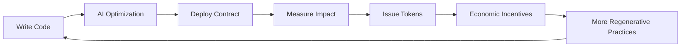

# 🚀 **Getting Started with HyperDev IDE**

## **Your First Regenerative dApp in 15 Minutes**

Welcome to HyperDev IDE - the world's first **Regenerative Programming Environment**! This guide will walk you through creating your first regenerative application that generates real environmental impact while you code.

---

## 📋 **Prerequisites**

Before starting, ensure you have:

- **Node.js 18+** and **npm** installed
- **Git** for version control
- **MetaMask** or compatible Web3 wallet
- **VS Code** (optional, for extension features)

---

## ⚡ **Quick Start (5 Minutes)**

### **1. Clone and Setup**

```bash
# Clone the repository
git clone https://github.com/your-org/PocketFlow-Tutorial-Cursor.git
cd PocketFlow-Tutorial-Cursor

# Navigate to HyperDev IDE
cd hyperdev-ide

# Install dependencies
npm install

# Start the development server
npm run dev
```

### **2. Open HyperDev IDE**

Open your browser to `http://localhost:3000` and you'll see:

```
┌─────────────────────────────────────────────────────────────────┐
│  🌍 HyperDev IDE - Regenerative Programming Environment         │
├─────────────────┬───────────────┬───────────────────────────────┤
│ 📁 Project      │ 💻 Monaco     │ 🕸️ Knowledge Graph          │
│ Explorer        │ Editor        │ Visualization                │
│                 │               │                               │
│ + New Project   │ Welcome!      │ [3D Hyperbolic Network]      │
│ 📊 Analytics    │ Start coding  │                               │
│ 🤖 AI Agents    │ regeneratively│ 🌱 Impact: 0 tons CO2e      │
│ 🔗 Web3 Status  │               │ 👥 Collaborators: 0          │
└─────────────────┴───────────────┴───────────────────────────────┘
```

### **3. Connect Your Wallet**

1. Click the **"Connect Wallet"** button in the top-right
2. Select MetaMask (or your preferred wallet)
3. Approve the connection
4. You'll see your address and balance displayed

✅ **Success!** You're now ready to build regenerative applications.

---

## 🌱 **Create Your First Regenerative Project**

### **Step 1: New Project Wizard**

Click **"+ New Project"** and select:

```typescript
Project Type: "Carbon Credit Marketplace"
Template: "Beginner Friendly"
Blockchain: "Polygon" (low carbon footprint)
AI Assistant: "Enabled"
```

### **Step 2: Project Configuration**

```yaml
# project-config.yaml (auto-generated)
name: "my-carbon-marketplace"
type: "regenerative_marketplace"
target_impact:
  carbon_sequestration: 100  # tons CO2e per year
  farmers_supported: 10      # number of farmers
  economic_value: 50000      # USD generated

stakeholders:
  - type: "farmer"
    count: 10
  - type: "corporate_buyer"
    count: 5
  - type: "verifier"
    count: 2

blockchain:
  network: "polygon"
  gas_optimization: "enabled"
  regenerative_scoring: "enabled"
```

### **Step 3: AI-Generated Smart Contracts**

The AI will automatically generate smart contracts for you:

```solidity
// Auto-generated CarbonCreditToken.sol
contract CarbonCreditToken is ERC20 {
    mapping(address => uint256) public carbonSequestered;
    
    function mintForImpact(
        address farmer,
        uint256 carbonAmount,
        bytes calldata verification
    ) external {
        // Verify impact measurement
        require(verifyImpact(verification), "Invalid verification");
        
        // Mint tokens based on impact
        uint256 tokens = carbonAmount * 10; // 10 tokens per ton CO2e
        _mint(farmer, tokens);
        
        carbonSequestered[farmer] += carbonAmount;
        emit ImpactVerified(farmer, carbonAmount, tokens);
    }
}
```

**What just happened?**
- AI analyzed your requirements
- Generated optimized smart contracts
- Integrated regenerative impact measurement
- Set up token economics aligned with environmental goals

---

## 🤖 **Using AI Agents**

### **Available AI Agents**

HyperDev IDE includes several specialized AI agents:

| Agent | Purpose | How to Use |
|-------|---------|------------|
| **🏗️ Architect Agent** | Smart contract design | `@architect design a carbon marketplace` |
| **🔍 Security Agent** | Code auditing | `@security audit my contracts` |
| **🌱 Impact Agent** | Regenerative optimization | `@impact optimize for carbon sequestration` |
| **📊 Analytics Agent** | Performance analysis | `@analytics show gas usage` |
| **🎨 UI Agent** | Frontend generation | `@ui create farmer dashboard` |

### **Example: Using the Impact Agent**

```typescript
// Type in the chat panel:
@impact "How can I optimize my carbon credit contract for maximum environmental benefit?"

// AI Response:
🌱 Impact Agent: I've analyzed your contract and found 3 optimization opportunities:

1. **Batch Minting** - Reduce gas costs by 60% with batch operations
2. **Biodiversity Bonus** - Add 25% bonus tokens for biodiversity improvements  
3. **Soil Health Integration** - Connect to IoT soil sensors for real-time verification

Would you like me to implement these optimizations?
```

Type `yes` and the AI will automatically update your code!

---

## 🔗 **Web3 Integration**

### **Connect to Real Impact Data**

```typescript
// In your project, add impact measurement:
import { ImpactMeasurement } from '@hyperdev/regenerative';

const impact = new ImpactMeasurement({
  sensors: ['soil_carbon_probe', 'satellite_monitoring'],
  verification: ['third_party_auditor', 'peer_validation'],
  frequency: 'weekly'
});

// Real-time impact tracking
impact.onMeasurement(async (data) => {
  console.log('🌱 New impact measurement:', data);
  
  // Automatically mint tokens for verified impact
  if (data.confidence > 0.9) {
    await carbonContract.mintForImpact(
      data.farmer,
      data.carbonSequestered,
      data.verification
    );
  }
});
```

### **P2P Collaboration**

```typescript
// Start a collaboration session
const session = await hyperdev.startP2PSession({
  type: 'code_review',
  participants: ['farmer.eth', 'verifier.dao'],
  economic_agreements: {
    review_payment: '25 USDC',
    impact_sharing: '5%'
  }
});

// Real-time code collaboration with economic incentives
session.on('participant_joined', (participant) => {
  console.log(`🤝 ${participant.username} joined`);
  console.log(`💰 Will earn ${session.agreements.review_payment} for participation`);
});
```

---

## 📊 **Monitoring Impact**

### **Real-time Impact Dashboard**

Your HyperDev IDE includes a built-in impact dashboard:

```typescript
// View your regenerative impact
const impact = await hyperdev.getImpactMetrics();

console.log('🌍 Your Regenerative Impact:');
console.log(`Carbon Sequestered: ${impact.carbon.sequestered} tons CO2e`);
console.log(`Farmers Supported: ${impact.social.farmersSupported}`);
console.log(`Economic Value Created: $${impact.economic.totalValue}`);
console.log(`Biodiversity Improvement: +${impact.biodiversity.improvement}%`);

// Your code is making a real difference! 🌱
```

### **Weekly Impact Reports**

Every week, you'll receive an automated report:

```
📧 Weekly Regenerative Impact Report

🌱 Environmental Impact:
   • Carbon Sequestered: 12.5 tons CO2e
   • Equivalent to removing 2.7 cars from the road
   • Biodiversity index improved by 8%

👥 Social Impact:
   • 3 farmers onboarded
   • $1,247 in direct payments
   • 2 communities reached

💰 Economic Impact:
   • $8,750 total value created
   • 78% value retained locally
   • Carbon credit price: $28/ton

🏆 Achievement Unlocked: "Carbon Hero" 
   You've sequestered over 10 tons of CO2!
```

---

## 🛠️ **Development Workflows**

### **Daily Development Routine**

1. **Morning**: Check impact dashboard for overnight measurements
2. **Coding**: Write code with AI assistance and real-time optimization
3. **Testing**: Deploy to testnet and simulate regenerative outcomes
4. **Collaboration**: Review code with stakeholders via P2P sessions
5. **Deployment**: Push to mainnet with automatic impact tracking
6. **Evening**: Review daily impact metrics and plan improvements

### **Code → Impact Cycle**



Every line of code you write contributes to this regenerative cycle!

---

## 🎯 **Example Projects You Can Build**

### **1. Beginner: Carbon Credit Marketplace** (1 week)
- **What**: Farmers sell carbon credits to corporations
- **Impact**: 100 tons CO2e sequestered annually
- **Skills**: Basic smart contracts, token economics
- **Templates**: `carbon-marketplace-basic`

### **2. Intermediate: Biodiversity Conservation DAO** (2 weeks)
- **What**: Community-governed habitat restoration
- **Impact**: 500 hectares of habitat protected
- **Skills**: DAO governance, NFTs, quadratic voting
- **Templates**: `biodiversity-dao-advanced`

### **3. Advanced: Regenerative Supply Chain** (1 month)
- **What**: Full supply chain with impact tracking
- **Impact**: 50 producers, 1000 tons CO2e, $500k farmer income
- **Skills**: Complex tokenomics, IoT integration, AI optimization
- **Templates**: `supply-chain-complete`

### **4. Expert: Circular Economy Platform** (3 months)
- **What**: Multi-stakeholder regenerative ecosystem
- **Impact**: Regional transformation, systemic change
- **Skills**: Multi-chain deployment, governance protocols, economic modeling
- **Templates**: `circular-economy-ecosystem`

---

## 🔧 **Advanced Features**

### **Knowledge Graph Visualization**

```typescript
// Explore your project's knowledge graph
const graph = await hyperdev.getKnowledgeGraph();

// 3D visualization in your browser
hyperdev.visualize(graph, {
  type: 'hyperbolic_3d',
  layout: 'poincare_disk',
  interactions: ['zoom', 'rotate', 'node_selection'],
  realtime_updates: true
});

// Understanding code relationships geometrically
// helps optimize for regenerative outcomes
```

### **Regenerative Code Analysis**

```typescript
// Analyze code for regenerative potential
const analysis = await hyperdev.analyzeRegenerativePotential(myContract);

console.log('🌱 Regenerative Analysis:');
console.log(`Carbon Efficiency Score: ${analysis.carbonEfficiency}/100`);
console.log(`Social Impact Potential: ${analysis.socialImpact}/100`);
console.log(`Economic Sustainability: ${analysis.economicSustainability}/100`);
console.log(`Systemic Transformation: ${analysis.systemicImpact}/100`);

// AI suggestions for improvement
analysis.suggestions.forEach(suggestion => {
  console.log(`💡 ${suggestion.title}: ${suggestion.description}`);
});
```

### **Multi-Chain Deployment**

```typescript
// Deploy across multiple eco-friendly blockchains
const deployment = await hyperdev.deployMultiChain({
  networks: ['polygon', 'celo', 'algorand'], // Low carbon footprint chains
  strategy: 'carbon_optimized',
  governance: 'cross_chain_dao'
});

// Your regenerative impact scales across ecosystems!
```

---

## 🤝 **Community & Support**

### **Getting Help**

1. **AI Assistant**: Built-in help for any question
   ```
   Ask: "How do I add biodiversity tracking to my project?"
   ```

2. **Community Discord**: Join 2,000+ regenerative developers
   - `#beginners` - Start here!
   - `#smart-contracts` - Technical discussions
   - `#impact-measurement` - Environmental focus
   - `#collaboration` - Find project partners

3. **Documentation**: Comprehensive guides at `docs.hyperdev.io`

4. **Office Hours**: Live help sessions every Tuesday & Thursday

### **Contributing to the Ecosystem**

```typescript
// Share your regenerative innovations
await hyperdev.shareInnovation({
  title: "AI-Powered Soil Analysis",
  description: "Real-time soil health monitoring using computer vision",
  impact: "Increases carbon measurement accuracy by 40%",
  license: "open_source",
  regenerative_score: 95
});

// Other developers can build on your work!
// You earn reputation and potential royalties
```

---

## 🚀 **Next Steps**

### **Your 30-Day Regenerative Journey**

**Week 1: Foundation**
- [ ] Complete your first carbon marketplace
- [ ] Connect real impact measurements
- [ ] Earn your first carbon credits

**Week 2: Collaboration**
- [ ] Join a P2P development session
- [ ] Contribute to a community project
- [ ] Deploy to mainnet

**Week 3: Innovation**
- [ ] Create a novel regenerative feature
- [ ] Share with the community
- [ ] Start building your reputation

**Week 4: Impact**
- [ ] Measure real-world outcomes
- [ ] Optimize for maximum regenerative benefit
- [ ] Plan your next regenerative project

### **Advanced Learning Paths**

1. **🧠 AI & Geometric Programming**
   - Deep dive into H²GNN architecture
   - Build custom AI agents
   - Hyperbolic optimization techniques

2. **🌐 Web3 & Decentralized Systems**
   - Advanced smart contract patterns
   - Cross-chain protocol design
   - Governance mechanism design

3. **🌱 Regenerative Economics**
   - Impact measurement methodologies
   - Token economics for sustainability
   - Systemic transformation strategies

4. **🔄 Systems Thinking**
   - Complex adaptive systems
   - Circular economy design
   - Regenerative business models

---

## 💫 **Welcome to Regenerative Programming!**

You're now ready to start building applications that heal the planet while advancing your career. Every line of code you write in HyperDev IDE contributes to:

- **🌍 Planetary Health**: Real carbon sequestration and biodiversity restoration
- **👥 Social Justice**: Direct economic benefits for farmers and communities  
- **💰 Economic Innovation**: New regenerative business models and token economics
- **🔄 Systemic Change**: Transformation toward circular, life-supporting systems

**Remember**: You're not just building software - you're building the future. A future where technology serves life, where programming is regenerative, and where every developer is an agent of positive change.

---

## 🎉 **Start Your Regenerative Journey Today!**

```bash
# Your regenerative future starts now:
cd hyperdev-ide
npm run dev

# Open http://localhost:3000
# Click "New Project"
# Select "Carbon Marketplace"
# Start coding for the planet! 🌍✨
```

**Welcome to the regenerative revolution. The planet is waiting for your code.** 🌱💚

---

*Questions? Join our Discord or ask the AI assistant in the IDE. The entire regenerative community is here to support your journey!*
